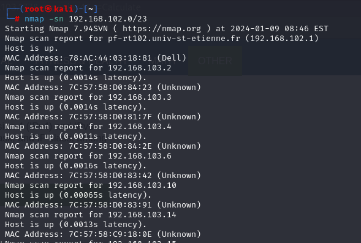
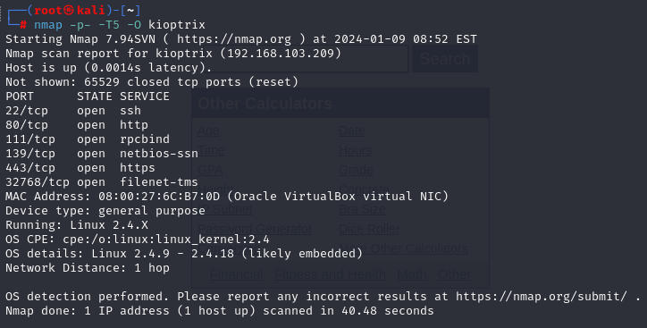
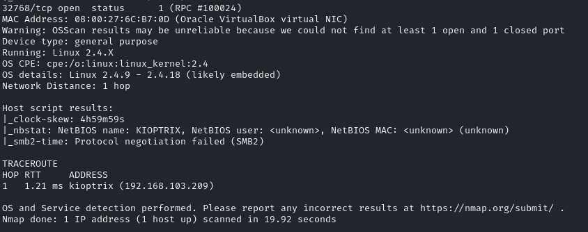
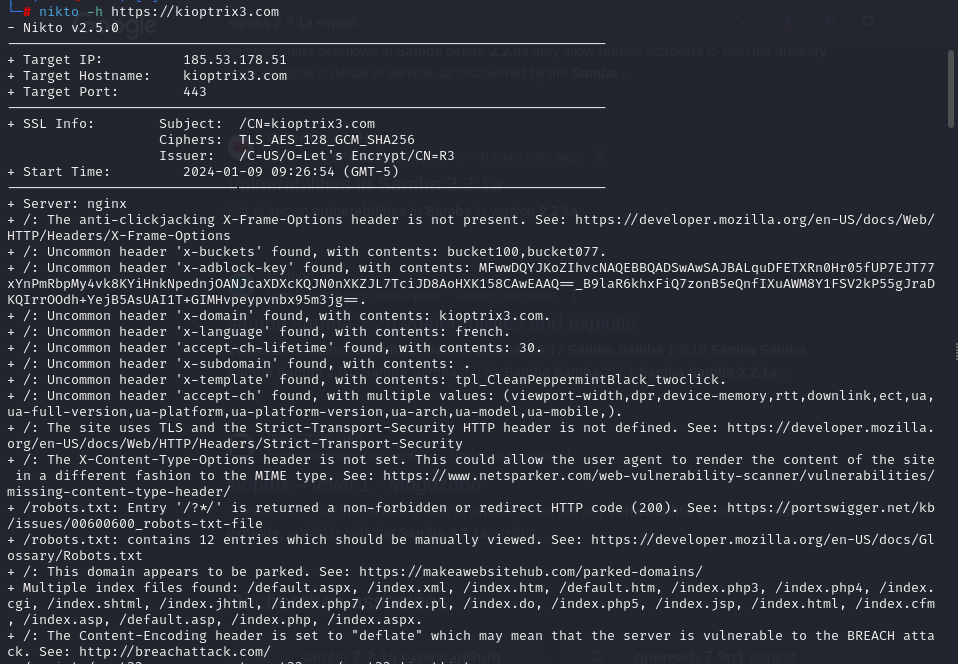
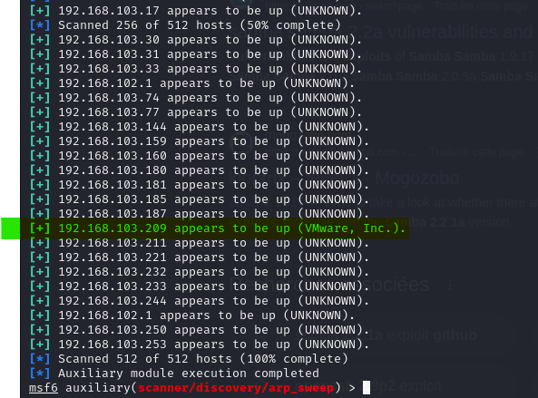
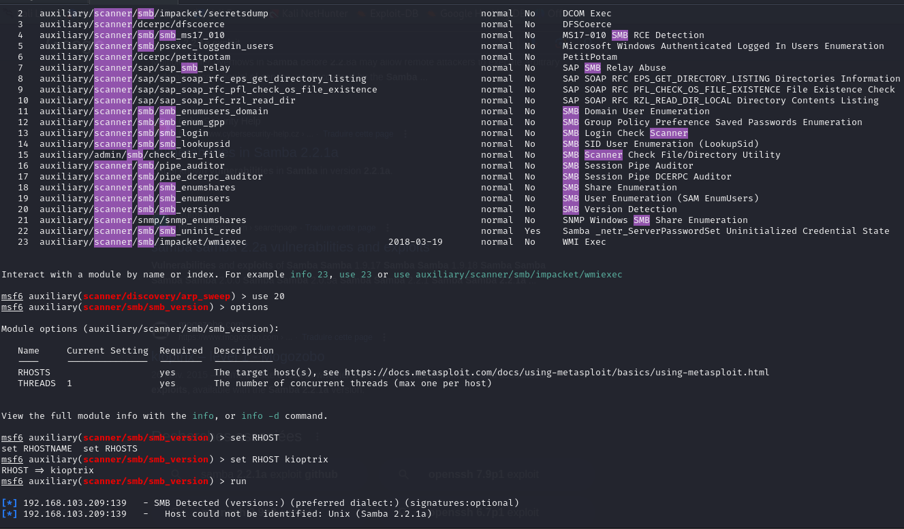
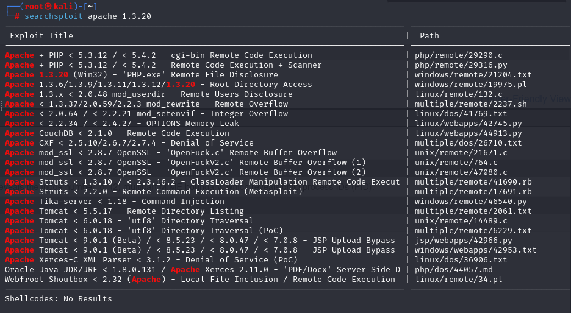
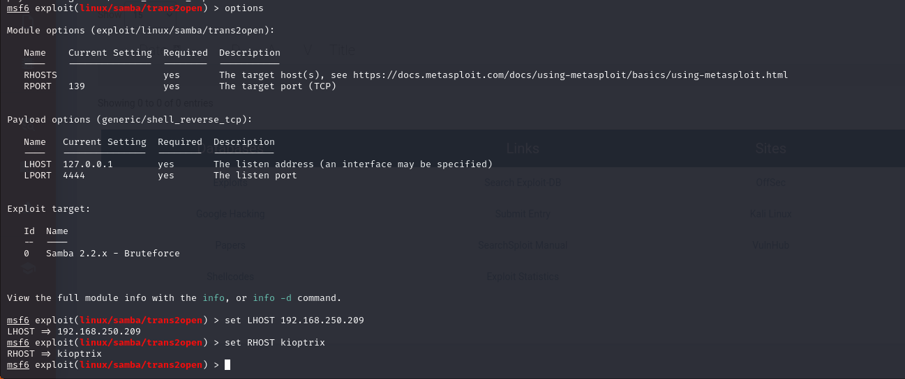
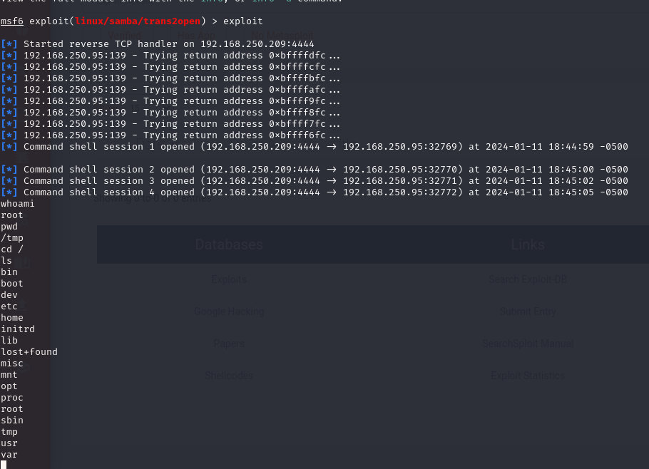

[Compte Rendu TP Kioptrix Boye-Mouhamed :]{.underline}

[Etape 1 : Phase de reconaissance :]{.underline}

Nous pouvons trouver notre machine cible avec netdiscover :

{width="5.222490157480315in" height="5.548896544181977in"}

Ici notre voisin qui héberge kioptrix utilise vmware qui est la seule
machine découverte par netdiscover

Ou encore avec nmap et son option -sn :

Ce scan est plus rapide

{width="4.090487751531058in"
height="2.7570866141732284in"}

Découverte des ports avec nmap :

{width="5.028035870516185in"
height="2.5487423447069117in"}

Ici on utilise l'option -T5 pour aller plus vite, cette option n'est pas
furtive et est facilement detectable.

[Etape2 : Enumeration :]{.underline}

Nous allons decouvrir les services et les versions utilisés avec nmap :

{width="6.3in"
height="5.348611111111111in"}

{width="5.572167541557305in"
height="2.2050995188101488in"}

Nous disposons de plusieurs services ouverts connaissant également
certaines versions 

-   SSH : Openssh 2.9.p2

-   HTTP : Apache 1.3.20

-   SMB : Samba X

-   HTTPS : Apache 1.3.20

-   Linux_kernel : 2.4

-   Mod_ssl : 2.8.4

-   Openssl : 0.9.6b

Nous pouvons également utiliser nikto pour trouver des failles sur les
port 80 et 443 :

HTTPS :

{width="4.911386701662292in"
height="3.4041885389326336in"}

HTTP :

{width="4.523826552930884in"
height="2.9739971566054244in"}

[Avec Metasploit :]{.underline}

Configuration du scanner arp :

{width="6.3in"
height="4.050694444444445in"}

On retrouve encore une fois l'ip de la machine :

{width="4.118267716535433in"
height="3.0487674978127735in"}

On retrouve également les services avec db_nmap :

{width="6.3in"
height="1.8347222222222221in"}

Version de samba :

En utilisant la commande search scanner smb on trouve le module 20 qui
permet de trouver la version de samba :

{width="6.3in"
height="3.69375in"}

Ici on a la version 2.2.1a

Nikto nous avait également indiqué une cve sur le port 80 :

{width="4.284235564304462in"
height="2.328182414698163in"}

Recherche des failles :

Nous allons tenter de trouver des faillles pour chacun des services avec
searchsploit :

{width="6.3in"
height="2.0909722222222222in"}

{width="6.3in"
height="3.459722222222222in"}

{width="6.3in"
height="1.6291666666666667in"}

[Etape 3 : Phase d'exploitation :]{.underline}

Ici on pouura utiliser metasploit pour exploiter la faille smb :

On selectionne le bon module :

{width="6.3in"
height="1.6520833333333333in"}

On choisi le bon payload qui exécutera un reverse shell une fois que
l'exploit aura fonctionné :

{width="6.3in"
height="3.3645833333333335in"}

On renseigne les options :

[Remarque :]{.underline} j'ai renseigné l'ip de kioptrix dans mon
fichier /etc/hosts

{width="6.3in"
height="2.642361111111111in"}

On exploite :

{width="6.3in"
height="4.555555555555555in"}

Et ainsi on est root et nous avons accès à la machine 
